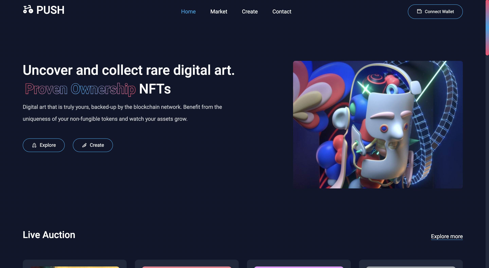
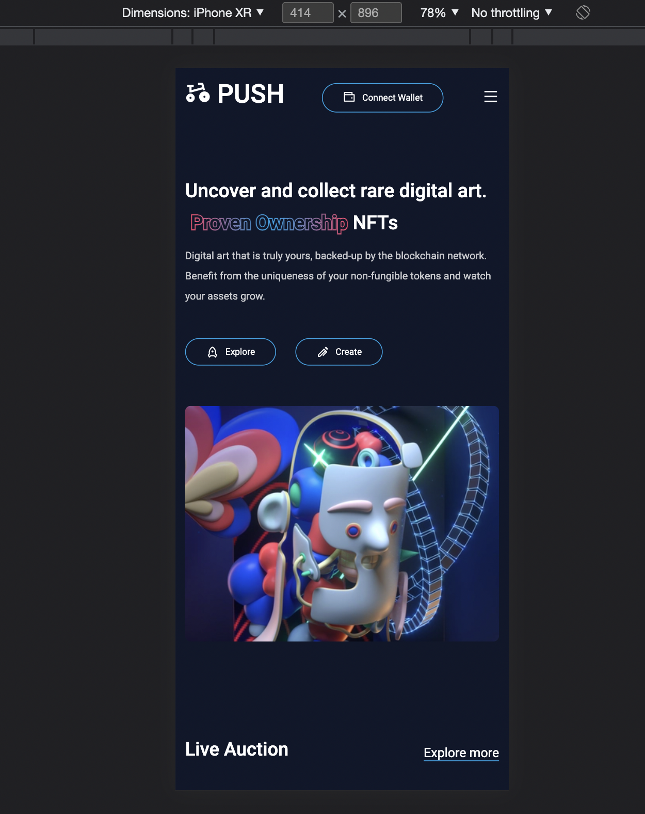

# NFT Marketplace - P U S H
I built this website as a portfolio showpiece. I used a variety of new tools and different techniques whereever I could. This project has taken me quite a substantial amount of time so I hope you enjoy it. 

to see it live 👉 https://nft-marketplace-push.netlify.app/home (you may need to clikc 'back to site' to reach it - working on a resolve)

## 🔧 How It Was Made
- ⚛ React - Hooks
- 👢 Bootstrap
- ⚛️ Reactstrap
- 🔩 Remix Icons
- 🗺 React Router Dom
- 👾 Create-react-app

## How It Looks
I modelled the colour palette off tailwindcss.com because I love the colours. 

### Desktop

### Mobile 

## Try it yourself...
### `git clone ...`
### `npm install`
### `npm start`

## 🧠 What I Learned
- [x] Setting a gradient background to text
- [x] Integrating and using bootstrap with React
- [x] Structuring folders more appropriately
- [x] Using react router correctly
